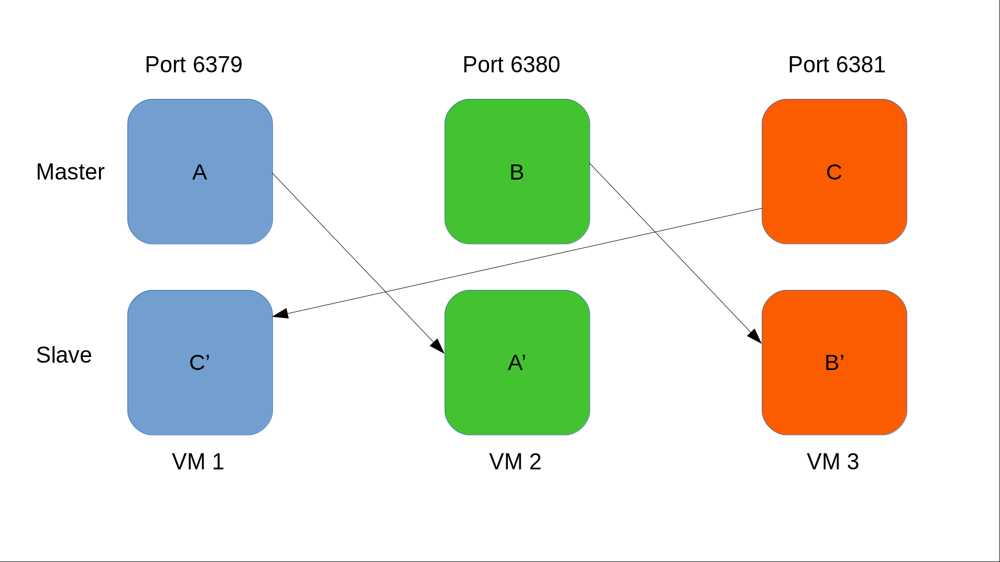

# Redis cluster deployment 

This code implements a declarative deployment of a Redis cluster.

## Getting Started

The only dependecies should be a Vagrant and a working VirtualBox installation on your local machine.

### Prerequisites

Download and run the latest Vagrant installer for your OS (vesrion>2.0) using below link:

```
https://www.vagrantup.com/downloads.html
```

Download and install the latest Virtualbox package for your OS using below link:

```
https://www.virtualbox.org/wiki/Downloads
```

### Installation

The deployment needs a place to run. Hence, we need a vagrant linux box in order to get the environment up and running. I have chosen 
an Ubuntu LTS version (18.04) box for my deployment. Please follow the steps below to download locally the required box:

```
1)run: vagrant box add bento/ubuntu-18.04 
2)choose virtualbox
```

Above command need to be run once per host.

## Architecture



A top level view of the architecture is visible on the icon above or ARCHITECTURE.png file included as a document in this repo. General deployment info:

The code deploys a Redis-cluster. Redis is an open source (BSD licensed), in-memory data structure store, used as a database, cache and message broker (https://redis.io/topics/introduction).
Redis is written in ANSI C and works in most POSIX systems like Linux, *BSD, OS X without external dependencies.  Redis Cluster was released with the 3.0.0 release of Redis on April 1, 2015
and it is a distributed implementation of Redis. As mentioned here - https://redis.io/topics/cluster-spec, Redis cluster's main goals are:

● High performance and linear scalability up to 1000 nodes.

● Acceptable degree of write safety.

● Availability.

The minimum suggested configuration required to setup a redis cluster is 3 masters and 3 slaves. Ultimately, we should have deployed 6 VMs (3 Masters + 3 Slaves). However, due to lack of
hardware resources on my laptop i have deployed 3 linux VMs and spawned 2 instances of redis. Hence, on each VM we're having 2 main processes to run & monitor:

● The redis master proccess.

> Uses a modified configuration file to run which can be found under /etc/redis/
e.g. /etc/redis/a_master.conf
The proccess starts on each node through supervisor conf file : /etc/supervisor/conf.d/redis_master.conf

● The redis slave proccess.

> Uses a modified configuration file to run which can be found under /etc/redis/
e.g. /etc/redis/c_slave.conf
The proccess starts on each node through supervisor conf file : /etc/supervisor/conf.d/redis_slave.conf

(Please also have a look on ARCHITECTURE.png file which clarifies the design)

In order to deploy the redis cluster and based on the assignment's suggested technologies i have built my implementation using below tools:

>Vagrant 

Simple to use and run. Although it is mostly being used for generating reproducible testing environements, we needed an automated and portable way for bringing up our servers. 
However, provisioning is being handled with Ansible. Hence, moving the deployment to other envs (e.g. a public cloud) would be a straighforward process.

>Virtualbox 

Running and installing it is hassle-free on most operating systems. Also Vagrant's hypervisor driver works great with it.

>Ansible 

A configuration management tool for handling the package installations and generally the env provisioning. Ansible (and CM tools) would also help us structure an idempotent solution.

>Supervisord 

Widely used and mature for production. I wanted an application specific proccess control system being also able to gracefully handle proccesses.
Hence, by using supervisor we can monitor what is happening specfically with the redis-cluster processes. Moreover, supervisor offers a web interface which we
could use in order to have a clear view of the proccesses statuses.

## How to Deploy

THe project consists of the following files and dirs:

```
/redis_deployment/:

    README.md: what you're currently reading!

    ARCHITECTURE.png: A simple diagram visualizing the deployment's architecture.

    provision/: Directory holding our ansible playbooks.

    debug/: Debug info are being saved inside this directory.

    scripts/: Purpose of this directory is to hold any files that we will be using in order to test the redis-cluster deployment. Currently a single script 
    that collects various useful info using redis-cli exists. Output is being dumped into the debug dir.

    templates/: Modified configuration templates for our services.

    Vagrantfile: File being consumed by vagrant to orchestrate the deployment. 

    vagrant.yml: File used for defining some environment specific variables (VM IPs, ports etc.)
```

All files needed for bringing up the redis-cluster environment exist inside the directory _redis_deployment_. The whole process is being orchestrated using a 
Vagrantfile. Below commands are sufficient to handle the deploy/destroy/provision of the redis-cluster env:

Bring up the env:
```
cd redis_deployment
vagrant up
```

Destroy the env:
```
cd redis_deployment
vagrant destroy
```

Run only the provisioning steps:
```
cd redis_deployment
vagrant provision
```

Check statuses of supervisor's redis-cluster processes on each VM instance:
```
open a browser and navigate to:
<machine_ip:9001>

```
** NOTE! The redis-cluster VMs are using some default IPs. If you want to change the default IP modify the following file: **
```
/redis_deployment/vagrant.yml
```

Same IPs are being passed as variables to the ansible hosts configuration file:
```
/redis_deployment/provision/hosts.yml
```

** Hence, you only need to change /redis_deployment/vagrant.yml file. **

Once the environment is up and running the provisioning is being handled using below files:

>provision/playbook.yml 

The playbook.yml handles all the installation and configuration steps to bring up the redis-cluster. This playbook is being used to install the required packages, setup the environment and start the services. Specifically, the playbook.yml plays 
the _setup_redis_ role on all nodes of hosts.yml. This is the role which installs all the neccessary packages and starts the services. The cluster is being realized by playing the role _deploy_cluster_ on any of the existing nodes once _setup_redis_ 
has ran on every node of the cluster. The file hierarchy is visible below:

```
└── roles
     ├── deploy_cluster
     │   ├── handlers
     │   │   └── main.yml
     │   └── tasks
     │       ├── main.yml
     │       └── redis_cluster.yml
     └── setup_redis
         ├── handlers
         │   └── main.yml
         └── tasks
             ├── main.yml
             ├── prereq.yml
             └── redis.yml

```

### setup_redis role

** setup_redis Tasks: **

Below are the tasks we're using
```
└── tasks
    ├── main.yml
    ├── prereq.yml
    └── redis.yml
```

>main.yml

This is the the setup_redis role entry point.

>prereq.yml

Trying not to rely on the underlying OS, i am installing some packages that are considered to be prerequisites for my deployment and installation. Here i am installing curl, supervisord and ruby which is 
needed to run the cluster deloyment script. Once installed, i am updating supervisord configuration as well as copying the cluster's configuration files (found in /redis_deployment/templates directory) into the supervisor's 
/etc/supervisor/conf.d/ directory. Now the redis-cluster processes start with supervisord instead of another init daemon.

>redis.yml

Used for installing latest redis DB, disabling it from systemd as well as setting up the cluster configuration script which we will be using later to setup the cluster (redis-trib.rb).

** setup_redis Templates: **

e.g. for clusternodeA 

```
├── templates
│   ├── clusternodeA
│   │   ├── general
│   │   │   └── supervisord.conf
│   │   ├── redis
│   │   │   ├── a_master.conf
│   │   │   └── c_slave.conf
│   │   └── supervisor
│   │       ├── redis_master.conf
│   │       └── redis_slave.conf

```

Each node has its own configuration files and they are being injected into a specific location in the instance using the Vagrantfile (file provisioner).
The file names that were used for the configuration files are common accross instances. Hence, we are having one _setup_redis_ role that can be applied to all nodes.

>general/supervisord.conf

Modified supervisord configuration file, adjusted to our needs.

>redis/a_master.conf

Redis master cluster-enabled template for node A.

>redis/c_slave.conf

Redis slave cluster-enabled template for node A.

>supervisor/redis_master.conf

The configuration file which starts the redis master process through supervisord.

>supervisor/redis_master.conf

The configuration file which starts the redis slave process through supervisord.


**  setup_redis Handlers: **

```
├── handlers
    └── main.yml
```
>main.yml

Handlers for triggering events at the end of the playbook. Currently a handler that disables redis from systemctl exist.

### deploy_cluster role

** deploy_cluster Tasks: **

Below are the tasks we're using
```
└── tasks
    ├── main.yml
    └── redis_cluster.yml
```

>main.yml

This is the the deploy_cluster role entry point.

>redis_cluster.yml

This playbook is being used for setting up the cluster using the script redis-trib.rb (http://download.redis.io/redis-stable/src/redis-trib.rb). This script already exist on /redis_deployment/templates/cluster_scripts/ directory
and helps us create and manage a redis cluster. i.e. Setup the cluster and define how many masters we will be using as well as adding new slaves to the cluster.

**  deploy_cluster Handlers: **

```
├── handlers
    └── main.yml
```
>main.yml

Handlers for triggering events at the end of the playbook. Currently a handler that checks the replication status of the cluster exists.

## Future Improvements

Password protect the databases so that a password is required when setting up the master/slave nodes.

Make supervisor's healthcheck endpoint port a global variable defined in vagrant.yml.

Install a monitoring agent through ansible during deployment time so that we get a clear view of what is happening (resources utilization, proccesses etc.).

A Jenkinsfile where stages of the deployment, testing etc. can easily be seen should be come handy for CI purposes.

## Built With

* [Ansible](https://www.ansible.com/) - Configuration Management
* [Vagrant](https://www.vagrantup.com/) - Build and maintain portable virtual software development environments
* [Supervisor](http://supervisord.org/) - Control processes related to a project or a customer
* [Virtualbox](https://www.virtualbox.org/) - A cross-platform hypervisor
* [Redis](https://redis.io/) - In-memory data structure store, used as a database, cache and message broker

## Useful links

* https://docs.ansible.com/ansible/latest/modules/modules_by_category.html (ansible modules main page)
* https://serversforhackers.com/c/monitoring-processes-with-supervisord (monitoring processes with supervisord)
